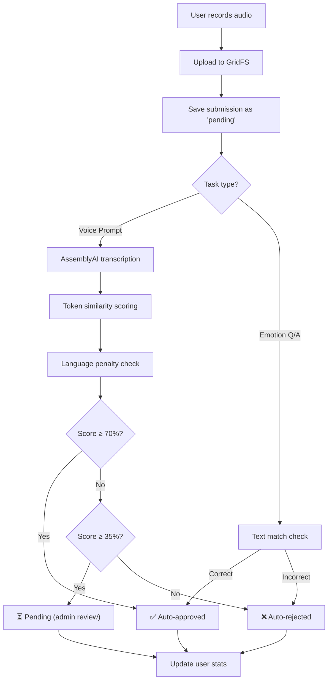
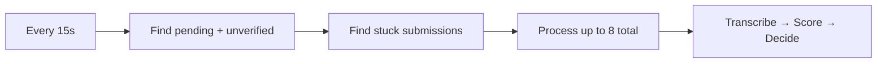

# xTraka — AI Verification & Scoring System

How tasks are validated, scored, and approved using AssemblyAI and supporting components.

---

## Overview

When a user submits audio for a **Voice Prompt** task, the system automatically:

1. Records and uploads the audio to GridFS
2. Sends the audio to **AssemblyAI** for transcription
3. Compares the transcript against the original prompt text
4. Scores the accuracy and auto-approves, leaves pending, or auto-rejects
5. Updates the user's trust score, badge, and reward balance



---

## The Pipeline, Step by Step

### Step 1: Submission

**File:** [submissionController.js](file:///home/xtraka/htdocs/xtraka.com/xTraka/backend/controllers/submissionController.js)

When a user submits work:

| Check | What happens |
|-------|-------------|
| Daily limit | Checks `max_daily_submissions_per_user` per language+category |
| Trust score | Rejects if below `min_trust_score_to_submit` |
| Audio upload | Stores `.webm` audio in **MongoDB GridFS** (not filesystem) |
| Quick checks | Runs `ffprobe` to verify audio isn't corrupted |
| Save | Creates a `Submission` record with status `pending` |
| Fire-and-forget | Kicks off `runWhisperValidation()` asynchronously |

The user gets an **immediate response** — they don't wait for AI processing.

---

### Step 2: AssemblyAI Transcription

**File:** [aiVerification.js](file:///home/xtraka/htdocs/xtraka.com/xTraka/backend/utils/aiVerification.js) → `transcribeAudio()`

The audio buffer is sent to AssemblyAI's speech-to-text API.

#### How it works

1. **Word boosting**: Before transcribing, we extract unique words from the original prompt and send them as `word_boost` with `boost_param: 'high'`. This helps AssemblyAI recognize language-specific words (Igbo, Hausa, Pidgin).

2. **Two-pass transcription**:
   - **Pass 1**: Uses `universal-3-pro` and `universal-2` speech models, with word boost only (no language hint)
   - **Pass 2**: If Pass 1 returns empty, retries with `language_detection: true` as fallback

3. **Output**: Returns the transcript text and the detected language code (e.g., `ig`, `ha`, `en`)

> [!NOTE]
> The system writes the audio to a temporary file, sends it to AssemblyAI, then cleans up the temp directory. AssemblyAI processes the audio remotely — no local ML models are needed.

---

### Step 3: Text Similarity Scoring

**File:** [aiVerification.js](file:///home/xtraka/htdocs/xtraka.com/xTraka/backend/utils/aiVerification.js) → `tokenSimilarity()`

This is the **core accuracy metric**. It compares the AssemblyAI transcript against the original prompt.

#### Normalization pipeline

Both texts go through identical normalization before comparison:

```
Original text → Arabic transliteration (if needed)
             → toLowerCase()
             → NFD unicode normalization
             → Strip diacritics/accents
             → Remove non-letter/number characters
             → Collapse whitespace
```

This ensures fair comparison across languages with diacritics (e.g., Igbo's `ụ`, `ọ`, `ṅ`).

#### Two scoring methods (best one wins)

| Method | How it works | Good at |
|--------|-------------|---------|
| **Word-level fuzzy match** | For each source word, finds the best matching word in the transcript using character overlap. Short words (≤3 chars) need 70% match; longer words need 50%. | Standard speech with clear word boundaries |
| **Character overlap** | Removes all spaces and calculates character-by-character overlap ratio between entire texts | Catching words that were split/merged differently |

The **higher** of the two scores is used as the final accuracy percentage.

#### Example

```
Source:  "Biko gwa m aha gị"   → normalized: "biko gwa m aha gi"
Transcript: "biko gwa m aha gi" → normalized: "biko gwa m aha gi"
Word match: 5/5 = 100%
```

---

### Step 4: Language Penalty

**File:** [validationQueue.js](file:///home/xtraka/htdocs/xtraka.com/xTraka/backend/utils/validationQueue.js)

After scoring, the system checks if AssemblyAI detected the **correct language**:

| Task Language | Accepted codes |
|-------------|---------------|
| Igbo | `ig` |
| Hausa | `ha`, `ar` |
| Pidgin | `en`, `pcm` |

If the detected language **doesn't match**, a **-15% penalty** is applied to the score.

```
Final Score = text_match_score + language_adjustment
           = 75% + (-15%) = 60%   ← wrong language detected
           = 75% + 0 = 75%       ← correct language
```

---

### Step 5: Auto-Decision (3-Tier Thresholds)

**File:** [constants.js](file:///home/xtraka/htdocs/xtraka.com/xTraka/backend/utils/constants.js)

| Score | Decision | What happens |
|-------|----------|-------------|
| **≥ 70%** | ✅ **Auto-approved** | User gets reward credited immediately |
| **35–69%** | ⏳ **Pending** | Stays in queue for admin manual review |
| **< 35%** | ❌ **Auto-rejected** | User sees rejection reason with their score |

> [!IMPORTANT]
> A score below 35% triggers an automatic rejection with the message: _"Reading accuracy too low (X%). At least 35% match required."_

---

### Step 6: User Stats Update

**File:** [helpers.js](file:///home/xtraka/htdocs/xtraka.com/xTraka/backend/utils/helpers.js)

After every decision, the user's profile is updated:

#### Trust Score

```
Trust Score = average(overallConfidence of ALL approved submissions)
```

This is the **mean accuracy** across all approved work. A user who consistently scores 90%+ on approved tasks will have a high trust score.

#### Badge Progression

| Badge | Min. Approved Submissions |
|-------|--------------------------|
| 🟢 Beginner | 0 |
| 🔵 Intermediate | 101 |
| 🟣 Expert | 201 |

#### Reward Tracking

| Counter | When updated |
|---------|-------------|
| `pendingRewards` | +reward on submission, -reward on decision |
| `approvedRewards` | +reward on approval |
| `withdrawnRewards` | +amount on withdrawal |

---

## The Background Queue Worker

**File:** [validationQueue.js](file:///home/xtraka/htdocs/xtraka.com/xTraka/backend/utils/validationQueue.js)

A **background loop** runs every **15 seconds** as a safety net. It catches submissions that weren't processed by the fire-and-forget call (e.g., if the server restarted mid-processing).



| Query | What it finds | Limit |
|-------|--------------|-------|
| Pending + no `verifiedAt` | Never processed at all | 5 |
| Pending + `verifiedAt` + empty transcript | Previously failed transcription | 3 |

---

## Emotion Q/A Tasks (Text-Only)

Emotion Q/A tasks skip the audio pipeline entirely:

1. User listens to an audio clip and selects an emotion
2. The selected emotion is compared **exactly** to `task.expectedAnswer`
3. **Correct** → instant approval (100% confidence)
4. **Incorrect** → instant rejection with feedback showing the correct answer

No AssemblyAI, no similarity scoring — it's a simple string match.

---

## Additional Checks

### Profanity Filter

Uses the `bad-words` npm package to scan transcripts for profanity. The result is recorded in `aiVerification.profanityDetected` and `profanityWords[]`, but does **not** currently affect the score directly.

### Audio Quality (ffprobe)

Before transcription, `ffprobe` extracts:
- Duration (seconds)
- Bitrate (bps)
- Sample rate (Hz)
- Whether the file is corrupted

Missing or corrupted audio → submission is rejected before reaching AssemblyAI.

---

## Data Model

All verification data is stored on the [Submission](file:///home/xtraka/htdocs/xtraka.com/xTraka/backend/models/Submission.js) document:

```js
aiVerification: {
  audioTranscription: "biko gwa m aha gi",  // AssemblyAI output
  transcriptionMatch: true,                  // score ≥ 35%
  overallConfidence: 85,                     // final accuracy %
  languageDetected: "ig",                    // AssemblyAI language
  languageConfidence: 80,
  profanityDetected: false,
  profanityWords: [],
  audioQuality: "ok",
  audioDuration: 4.2,
  verifiedAt: "2026-02-25T...",
  modelVersion: "assemblyai-v1"
}
```

---

## File Map

| File | Role |
|------|------|
| [submissionController.js](file:///home/xtraka/htdocs/xtraka.com/xTraka/backend/controllers/submissionController.js) | Receives submissions, runs quick checks, fires async validation |
| [aiVerification.js](file:///home/xtraka/htdocs/xtraka.com/xTraka/backend/utils/aiVerification.js) | AssemblyAI transcription, text similarity, profanity, language detection |
| [validationQueue.js](file:///home/xtraka/htdocs/xtraka.com/xTraka/backend/utils/validationQueue.js) | Background worker that catches unprocessed submissions every 15s |
| [constants.js](file:///home/xtraka/htdocs/xtraka.com/xTraka/backend/utils/constants.js) | Threshold values (70% approve, 40% review) |
| [helpers.js](file:///home/xtraka/htdocs/xtraka.com/xTraka/backend/utils/helpers.js) | Trust score calculation, badge progression |
| [Submission.js](file:///home/xtraka/htdocs/xtraka.com/xTraka/backend/models/Submission.js) | Mongoose schema with all verification fields |
